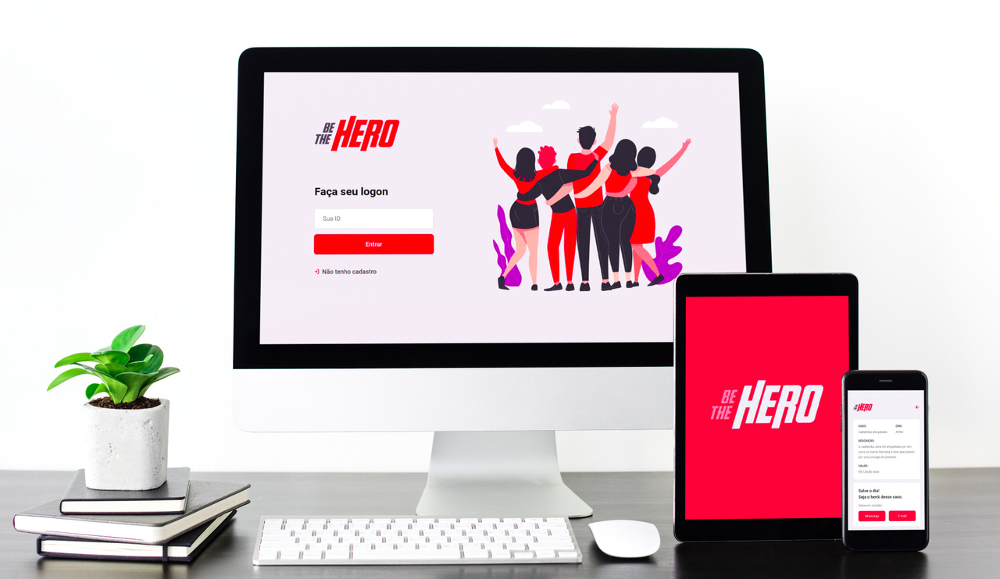

<h1 align="center">
    
</h1>

<p align="center">
	
  <a href="https://www.linkedin.com/in/jpmmadeira/">
    
  </a>

<a aria-label="Completed" href="https://rocketseat.com.br">
    </img>
  </a>
  
</p>

<p align="center">
  <a href="#-project">Project</a>&nbsp;&nbsp;&nbsp;|&nbsp;&nbsp;&nbsp;
  <a href="#rocket-Technologies">Technologies</a>&nbsp;&nbsp;&nbsp;|&nbsp;&nbsp;&nbsp;
  <a href="#-layout">Layout</a>&nbsp;&nbsp;&nbsp;|&nbsp;&nbsp;&nbsp;
  <a href="#memo-license">License</a>
</p>

## 💻 Project

Be The Hero is a project that aims to connect people who are willing to help ONGs.

<h1 align="center">
    
</h1>

## :rocket: Technologies

This project was developed with the following technologies:

- [Node.js](https://nodejs.org/en/)
- [React](https://reactjs.org)
- [React Native](https://facebook.github.io/react-native/)
- [Expo](https://expo.io/)

## 🔖 Layout

Access layout on  [Figma](https://www.figma.com/file/2C2yvw7jsCOGmaNUDftX9n/Be-The-Hero---OmniStack-11?node-id=0%3A1).

### Setup

```bash
$ cd backend
$ yarn install
$ npx knex migrate:latest

$ cd frontend
$ yarn install

$ cd mobile
$ yarn install
```

### Run the application

```bash
$ cd backend 
$ yarn start

$ cd frontend
$ yarn start

$ cd mobile
$ yarn start
```


## :memo: License

This project is under the MIT license. See the [LICENSE](LICENSE.md) for details.

---

Made by João Madeira during Rocketseat Omnistack Week v11 :wave: [Get in touch!](https://www.linkedin.com/in/jpmmadeira/)